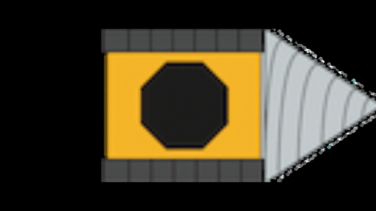

# Welcome!

This Website was created to support the documentation for our Drill Dungeon
Game. The game itself is the result of our second coursework of our Software
Engineering class at the University of Bath. All team members are currently
attending the MSc in Computer Science.

## Team Purple

- Ahmed Ahmadu
- John Chan
- Aditya Gaosindhe
- Oliver Hamler
- Zach Howard
- Maximilian Mekiska
- Hugh Surdeau
- Yiming Yuan

# Downloads

## Game

An exe version of the game can be downloaded here:

For the latest version please visit our GitHub repository [here](https://github.bath.ac.uk/hs706/DrillDungeonGame)

## Reports

Our reports can be downloaded below:

### Process documentation
<object data="documents/CW2_Process_Documentation.pdf" type="application/pdf" width="560" height="650">
</object>

### Product documentation
<object data="documents/CW2_ProductDocumentation.pdf" type="application/pdf" width="560" height="650">
</object>
