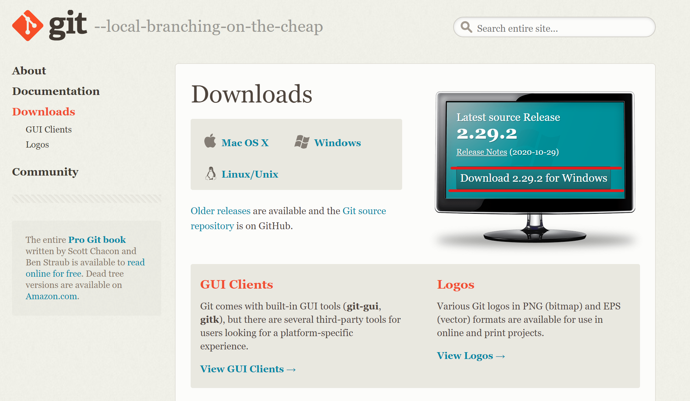

<style>
	div {
		text-align: justify;
		text-justify: inter-word;
		font-family: "Times New Roman";			
	}

	object {
		display: block;
		margin: 0 auto;
	}
	a[title="centre"] {
  display: block;
  width: 100%;
  text-align: center;
}
</style>

# Installation guide for Developer


## Install Python

1. There are various ways to install Python on your machine.  This guide demonstrates one way, so for alternative solutions, please refer [here](https://docs.python.org/3/using/windows.html)
2. Navigate [here](https://python.org/downloads)
3. Download the latest Python version by clicking the yellow button labelled “Download Python”. This library requires Python 3.8.5 or higher.

[](# "centre")

4. Make sure to check the box at the bottom labelled “Add Python to PATH” at the bottom before pressing “Install Now” so that you can run Python from the Windows command line.

[](# "centre")


## Install Git

1. Git installer can be downloaded [here](https://git-scm.com/downloads)
2. Navigate through the installer until installation is completed.

[](# "centre")

## Commands

### Setting up your virtual environment

Open the Windows command line and navigate to the directory you would like to install to repository:

``` console
cd path/to/directory
```

Clone the repository:
``` console
git clone git@github.bath.ac.uk:hs706/DrillDungeonGame.git
```

Navigate to the created directory:
``` console
cd DrillDungeonGame
```

### Windows
``` console
1. Make sure pip is up to date:

py -m pip install --upgrade pip

2. Install the virtual environment package to your base Python installation:

py -m pip install --user virtualenv

3. Create a virtual environment:

py -m virtualenv -p py .venv

4. Activating your virtual environment:

.\.venv\Scripts\activate

5. Installing requirements to your virtual environment:

py -m pip install -r requirements.txt

6. Running the game:

py main.py

7. Running the tests:

pytest tests/
```

### Linux, macOS
``` console
1. Make sure pip is up to date:

python3 -m pip install --user --upgrade pip

2. Install the virtual environment package to your base Python installation:

python3 -m pip install --user virtualenv

3. Create a virtual environment:

python3 -m virtualenv .venv

4. Activating your virtual environment:

source .venv/bin/activate

5. Installing requirements to your virtual environment:

python3 -m pip install -r requirements.txt

6. Running the game:

python3 main.py

7. Running the tests:

pytest tests/
```

# Installation guide for User

To install and play the Drill Dungeon Game, please download the .exe file either from the official Drill Dungeon Game website or the GitHub repository. Please make sure that your computer has a working version of Python 3.8.5 or higher installed. For the installation of Python, please refer to the explanation given above at 1.2.1 "Install Python".
