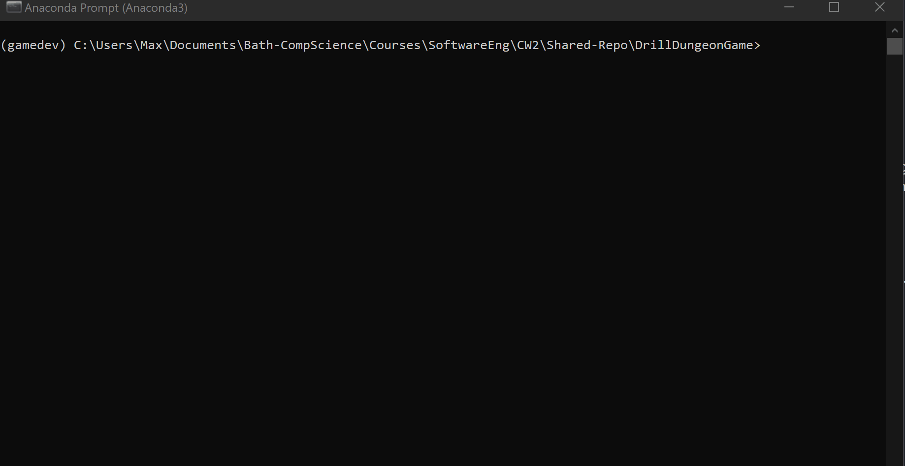
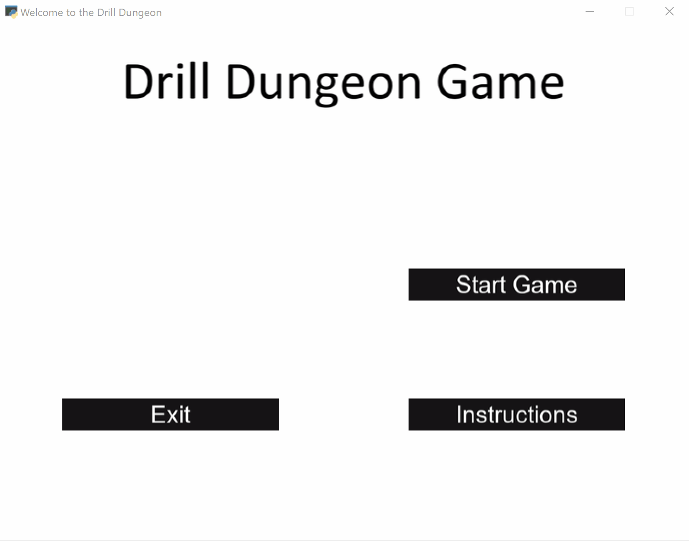

# User Manual

## Introduction:

This guide will guide you through every step necessary to start up and enjoy the Drill Dungeon Game. We hope that you will enjoy your adventures through the depths of exciting but dangerous dungeons.

## Starting the game:

Make sure that you have followed the Installation guide before continuing with this section. Now, please navigate into the Drill Dungeons Folder and start up the main.py python file:

You should now see a new window opening up which will bring you directly to the Drill Dungeon Game Main Menu.
On the main menu, you have the chance to click with a left mouse click on the instruction button which will display a short summary of all basic controls over which we will go now in detail. Furthermore, from the instruction menu you will be able to click on another summary that will display the main objectives of the game. If you wish to exit the game, just click on the exit button.

