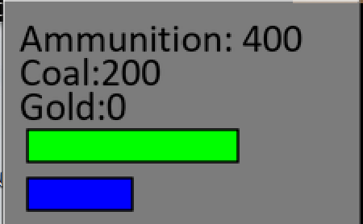
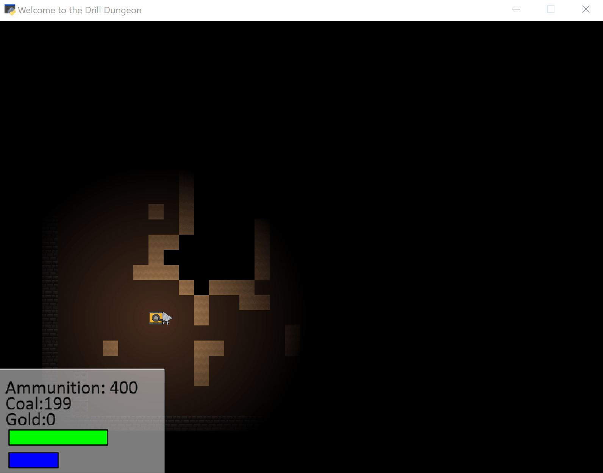
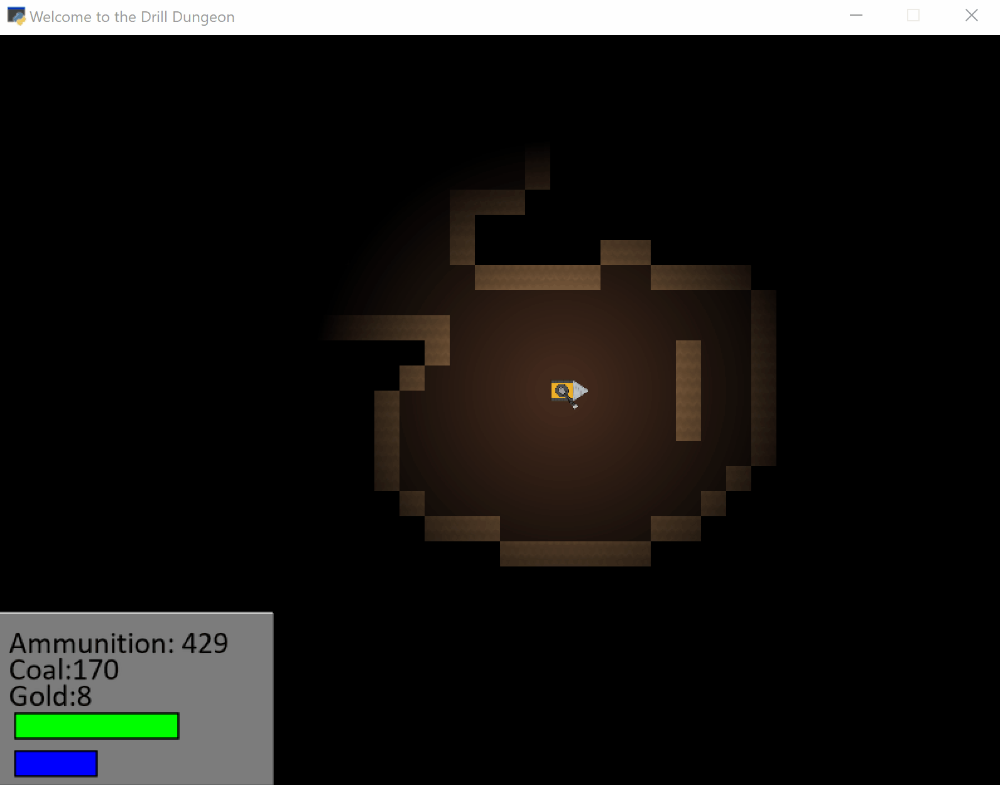
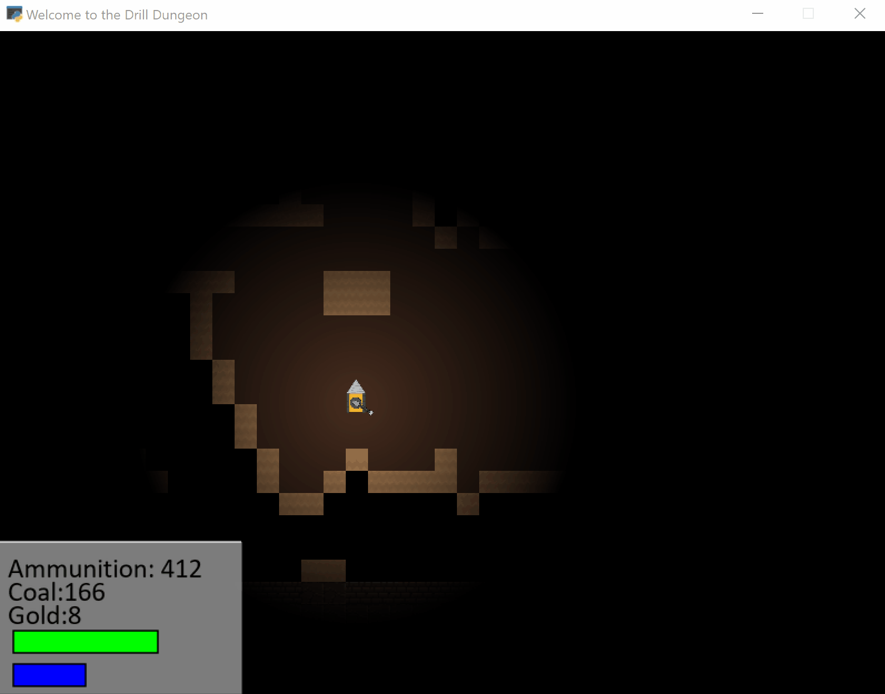
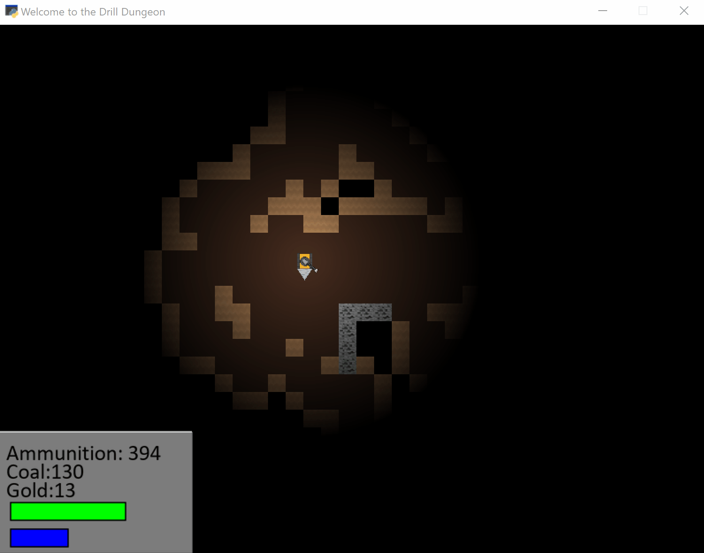

# User Manual

## Introduction

This guide will guide you through every step necessary to start up and enjoy the Drill Dungeon Game. We hope that you will enjoy your adventures through the depths of exciting but dangerous dungeons.

## Starting the game

Make sure that you have followed the Installation guide before continuing with this section. Now, please navigate into the Drill Dungeons Folder and start up the main.py python file:

You should now see a new window opening up which will bring you directly to the Drill Dungeon Game Main Menu.
On the main menu, you have the chance to click with a left mouse click on the instruction button which will display a short summary of all basic controls over which we will go now in detail. Furthermore, from the instruction menu you will be able to click on another summary that will display the main objectives of the game. If you wish to exit the game, just click on the exit button.
Please continue by clicking on the "Start Game" button with a right mouse click. The game will now begin:

Please have a look at the lower left corner. This is your HUD which will provide you with mission vital information and should be the best metric to decide tactical decisions during your adventure. The green bar represents your drills health. If the green bar is completely depleted your drill will explode and your mission failed:

So keep an eye on this metric before deciding to engage any further enemies. Below the green bar you will find your energy level that will power your shield. The shield will protect your drill from damage however it will not last forever. When depleted, the shield will disintegrate and leave you vulnerable to damage from enemies. But don't worry, your shield will recharge over time.

The values above health and the energy level will inform you about your drills inventory. Your inventory consists of Ammunition which supplies your turret with bullets. Coal, which severs as fuel for your drill and gold which can be used later in the game to purchase upgrades for your drill.

After you have made yourself familiar with the HUD, its now time to learn how to drive the drill. By pressing W, A, S, D you will be able to navigate the drill forward, left, backward and right. Your drill is also capable of drilling diagonally which can be done by pressing a pair of the in the former mentioned keys. As an example, if you wish to drill diagonally up to the right, press W and D simultaneously. As you, start driving and exploring the dungeon, you will notice that the drill drills through the dirt blocks and uncovers new paths and elements.

Have you noticed something in the HUD?... That's correct! Navigating the drill through the dungeon slowly depletes your coal supply. So make sure to drill for new coal because if your coal supply is fully depleted your drill will not move and its Game over. However, there is something else, if you look closely, ammunition has increased! That's good news! Driving will recharge not only the energy for your energy shield but also add bullets to your ammunition inventory.

Navigating through the dungeon will sooner or later lead to discoveries of resources. These resources are coal and gold. Coal, as explained before, will serve as your drills fuel. Gold on the other hand will serve later as currency for new drill upgrades.

To collect those precious resources your simply need to drill through them. Next, you will need to learn on how to self defend. If you are spotted by a hostile, it is essential for your survival to now how to use your energy turret. To fire the turret, you need to aim by pointing the mouse into the direction you want to fire and click the left mouse button to fire the turret. By default, the turret will fire a single shot for each click on the left mouse button:

For close contact combat your turret is capable of changing the fire mode to buck shot. This is done by clicking the B key:

A word of caution, bullets will not only defend from enemies but also destroy valuable gold and coal blocks:

Having learned the basics of shooting, now is the time to learn more about the enemies you will be encountering during the game. Enemies will be hiding in the dark and might catch you by surprise so be careful while exploring. However, sometimes you might see the enemy before he can see you. This will give you a strategic advantage. As a tip, prior taking the decision to engage the enemy, have a look at your inventory, health and energy shield levels:

As you can see in the above, the enemy hasn't detected us yet and we might decide to avoid combat because of our low health level. If you look closely, you will notice a similar health bar below the enemy. In combat you want to make sure that this health bar runs out faster than your own. In case it doesn't go as planned, it might be necessary to consider a tactical retreat. As a tip, if you need to retreat, use the shield to buy enough time to outrun the enemy. You can activate your shield by holding the right mouse button:

After having learned the basics of combat, lets have a look at the options you have to aid you in the quest of exploring the depths of the dungeons. During the game, you will be able to encounter friendly locals in form of shops. To interact with the shop, drive in its proximity and click on it with a left mouse click. A shop menu will open up and offer you a variety of purchasable upgrades. Furthermore, the shop offers to replenish your ammunition inventory:

During your journeys you will encounter not only natural caves and resources but also enemy built structures. These structures are usually made out of material that cannot be destroyed by shooting at it or drilling through it. Have a look at the example below:

